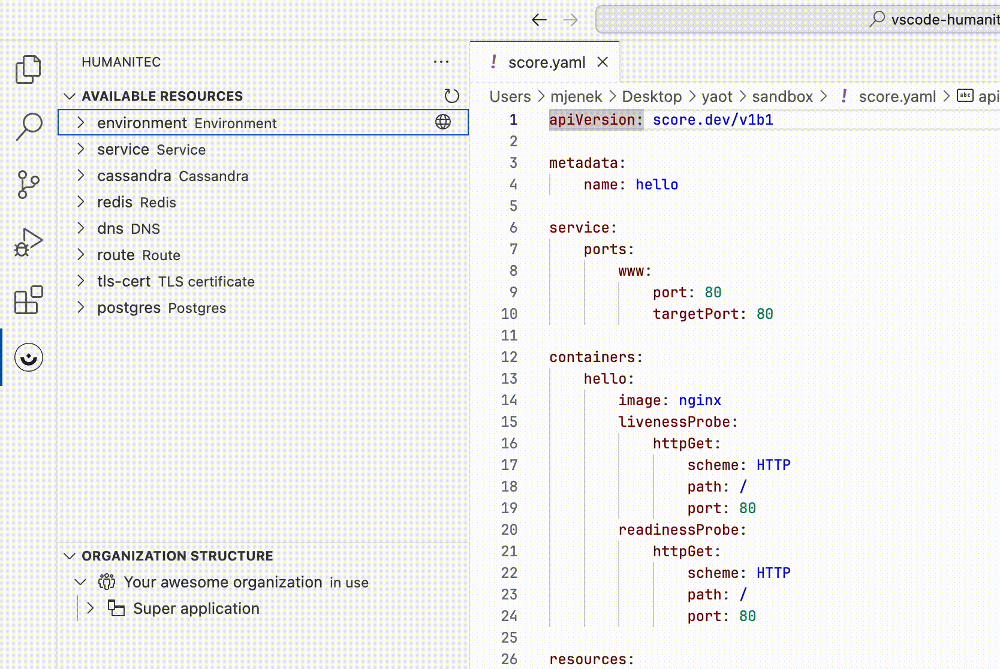
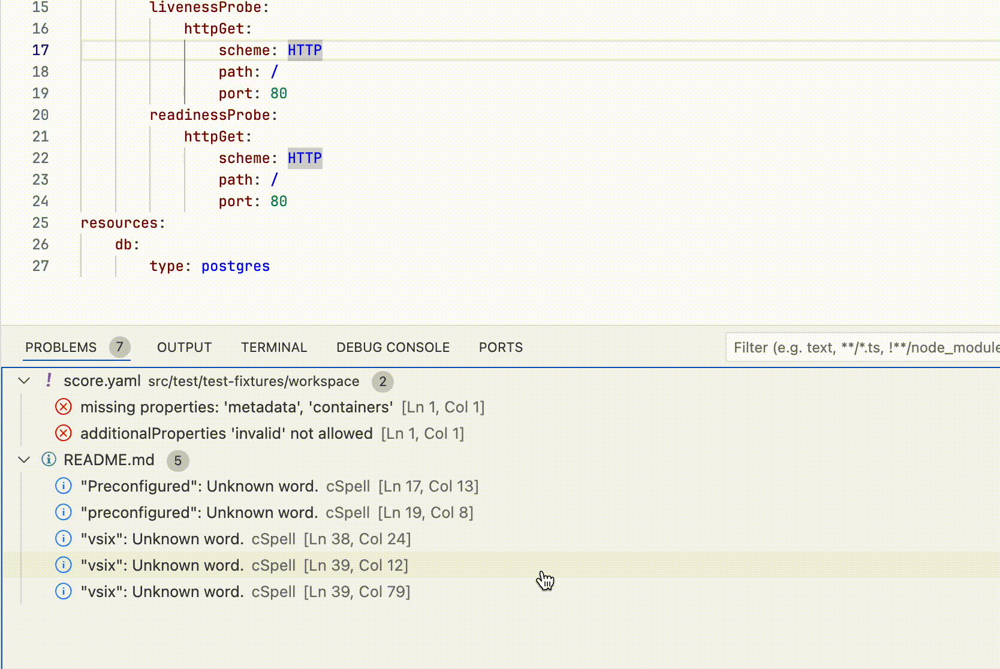
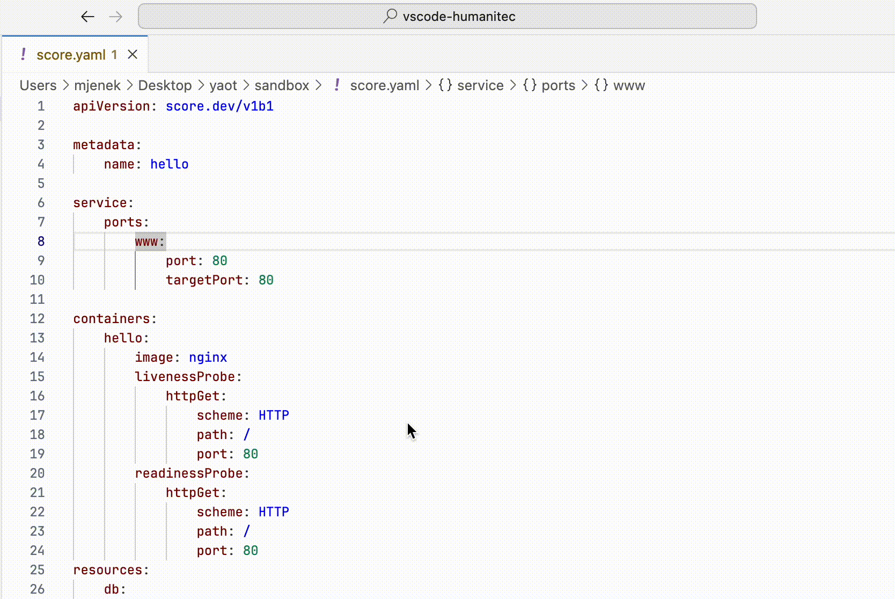
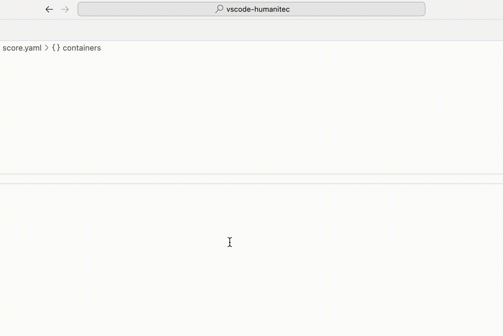
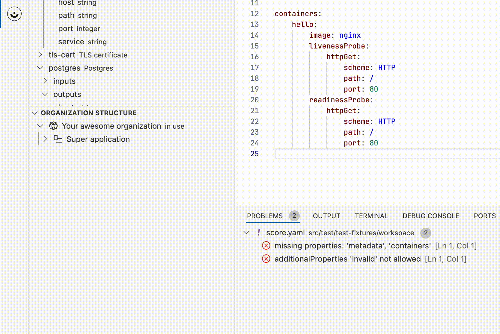

# Humanitec VSCode Extension

## Overview

Welcome to the Humanitec Platform VSCode Extension! This extension is designed to enhance your experience when working with the Humanitec Platform Orchestrator directly from Visual Studio Code. It provides a set of features to simplify your workflow, making it easier to manage your applications, components, and configurations.

## Features

### 1. Display Available Resource Types

Quickly view all available resource types that developers can use in Score files. This feature provides a comprehensive list, aiding in the efficient selection and utilization of resources in your applications.

### 2. Validate Score Files

Ensure the correctness of your Score files by leveraging the built-in validation feature. Detect and fix errors early in the development process to simplify your deployment workflow.

### 3. Open Preconfigured Terminal

Open a preconfigured terminal directly from Visual Studio Code, tailored to your Humanitec Platform environment. This allows you to execute commands and interact with the Terraform or Humanitec CLI seamlessly.

### 4. Display Resource Graph of Deployed Application

Visualize the resource graph of your deployed application directly within VSCode. Gain insights into the relationships between resources, making it easier to understand and manage your application architecture.

### 5. Easy Switch Between Orgs/Apps/Envs

Effortlessly switch between different organizations, applications, and environments with a simple and intuitive interface. This feature simplifies the navigation process, allowing you to focus on your development tasks.

## Getting Started

### Prerequisites

- Visual Studio Code installed
- Humanitec Platform account

### Installation

1. Download the latest vsix package: [releases](https://github.com/humanitec/vscode-humanitec/releases/latest)
2. Install vsix package using terminal: `code --install-extension humanitec-*.vsix` or following this guide: [Managing Extensions in Visual Studio Code](https://code.visualstudio.com/docs/editor/extension-marketplace#_install-from-a-vsix)

### Configuration

1. Open Visual Studio Code.
2. Login to the Humanitec Platform by pressing `Ctrl/Cmd+Shift+P` and using `Humanitec: Login` command.
3. Open Humanitec side and set context by right-clicking to the element of the `Organization structure` and choosing `Set in workspace` option.
4. You're ready to go!

## Feedback and Issues

We welcome your feedback and encourage you to report any issues you encounter. Feel free to open an issue on our [GitHub repository](https://github.com/mateuszjenek/vscode-humanitec/issues).

## License

This extension is licensed under the [Apache License 2.0](LICENSE).

Happy coding with Humanitec and Visual Studio Code!
